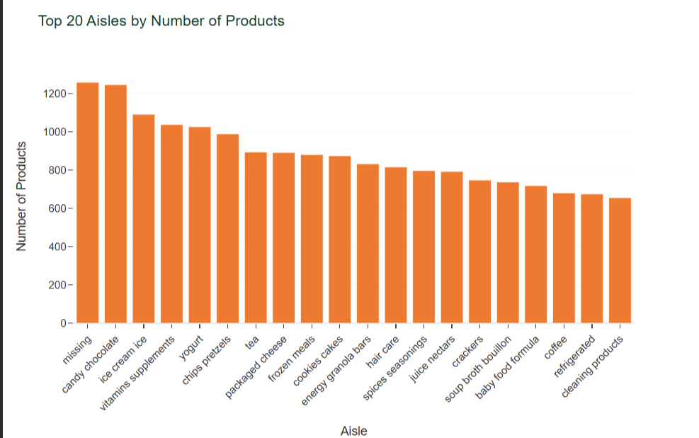

# Instacart Market Basket Analysis & Product Recommendation System

## Project Overview

This project analyzes customer purchasing behavior using the Instacart Online Grocery Shopping Dataset. The analysis identifies buying patterns, frequently purchased products, and product associations to support business decisions and recommendation systems.

---

# Business Problem

Online grocery retailers need to understand customer purchasing behavior to improve product recommendations, increase cross-selling opportunities, and enhance customer satisfaction.

---

# Business Objective

- Analyze customer purchase patterns
- Identify frequently purchased products
- Discover product associations
- Build a product recommendation approach
- Generate business insights for improving sales

---

# Dataset Information

| Item | Details |
|------|---------|
| Dataset | Instacart Online Grocery Shopping Dataset |
| Source | Kaggle |
| Data Type | Transactional Data |
| Tables Used | orders, order_products, products, aisles, departments |

---

# Technologies Used

- Python
- Pandas
- SQL
- Plotly
- Matplotlib
- Jupyter Notebook

---

# Project Workflow

1. Data Collection
2. Data Cleaning
3. Data Merging
4. Exploratory Data Analysis
5. Customer Purchase Analysis
6. Product Recommendation Analysis
7. Business Insights
8. Business Recommendations

---

# Project Features

- Data Cleaning
- SQL Analysis
- Customer Purchase Analysis
- Product Recommendation
- Product Frequency Analysis
- Department-wise Analysis
- Interactive Visualizations

---

# Skills Demonstrated

- SQL
- Data Cleaning
- Data Visualization
- Exploratory Data Analysis
- Business Analytics
- Recommendation Analysis

---

# Key Insights

- Some products are purchased together frequently.
- Fresh produce is the most popular department.
- Repeat customers contribute significantly to sales.
- A small number of products generate a large share of orders.
- Product recommendations can improve customer engagement.

---

# Business Recommendations

- Recommend complementary products during checkout.
- Promote frequently purchased products.
- Create personalized product recommendations.
- Improve inventory planning using purchasing trends.
- Offer targeted promotions for repeat customers.

---

# Repository Structure

Instacart-Market-Basket-Analysis

│
├── README.md
├── notebook.ipynb
├── report.pdf
├── requirements.txt
├── LICENSE

## Top Selling Products

---

# How to Run

1. Clone the repository

2. Install dependencies

pip install -r requirements.txt

3. Open the notebook

4. Run all cells

---

# Future Improvements

- Build recommendation models using collaborative filtering
- Deploy using Streamlit
- Create Power BI dashboard
- Improve recommendation accuracy

---

# License

This project is licensed under the MIT License.

